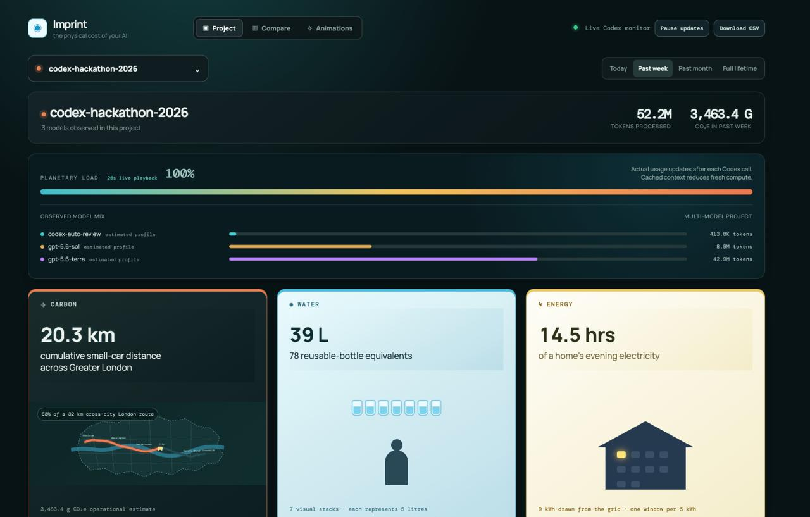

## Imprint - Track the Environmental Impact of Your Token Usage

Have you ever wondered about the environmental impact of your Codex usage?

Imprint helps you understand it in real time.

It measures your Codex sessions usage and translates it into estimated impact metrics: water consumption, carbon emissions, and energy use.

Features:

- View environmental impact by project or across all projects
- Monitor usage and progress in real time
- Compare projects, model versions, and effort levels

https://github.com/user-attachments/assets/5f65b274-c295-4642-812e-0d415265ffa4

Team members: Jeanne Piffaut, Lalit Kumar,  Igor Pejic

This project was built with Codex as part of the OpenAI Build Week Community Hackathon in London on July 18, 2026.
